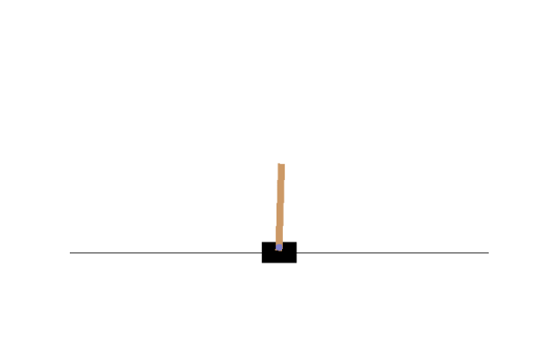

# genome
Binary neural networks have a low memory footprint and run crazy fast.
Let's use that to speed up reinforcement learning.

For example, this network is 500 bytes and performs 500,000 evaluations/second on my laptop CPU:

## Theory
The goal of this project is to train binary neural networks directly in a reinforcement learning environment using
[natural evolution strategies](http://www.jmlr.org/papers/volume15/wierstra14a/wierstra14a.pdf).
Binary networks are a great fit for RL because:
 - Much of the cost of training comes from needing to evaluate the policy network on every timestep.
 - [Derivative-free optimization is competitive with backpropagation-based algorithms in RL](https://openai.com/blog/evolution-strategies/)
   because the policy gradient is usually available only in expectation, and its Monte-Carlo approximations can be pretty bad.
   This means we can get away with a nondifferentiable model and a black box optimizer.
 - Evolution strategies are [highly parallelizable](https://arxiv.org/abs/1703.03864), 
   and many individual threads / cores can each run a binary neural network with ease.

#### Binary neural networks
The networks implemented here are a modification of [XNOR-Nets](https://arxiv.org/abs/1603.05279).
Each layer's weights, inputs, and outputs are constrained to being vectors of +/-1 values, which
are encoded as binary, and use the sign function as their nonlinearity. Layers compute the function
%20%3D%20%5Ctext%7Bsign%7D(W%5ETx%20%2B%20b)).

In exchange, these networks have an extremely fast forward pass because the dot product of binary-encoded +/-1 
binary vectors `x` and `y` is `n_bits - popcount(x XOR y)`, which can be computed in just a few clock cycles.
By baking the subtraction and the bias into the comparison for the sign function, we can speed up inference even more.
Each activation / weight vector is stored as a `uint64_t`, so memory access is very fast and usage is extremely low. 

#### Natural evolution strategies

[Evolution strategies](https://blog.otoro.net/2017/10/29/visual-evolution-strategies/)
work by maintaining a *search distribution* over neural networks. 
At each step, we sample a new population of networks from the distribution, evaluate each, then
update the search distribution towards the highest-performing samples.
Natural evolution strategies do this by following the 
[natural gradient](https://wiseodd.github.io/techblog/2018/03/14/natural-gradient/) to update
the search distribution in the direction of highest expected reward.

To train binary networks with NES, I use a separable Bernoulli distribution, parameterized by
a vector of logits. Each generation's update computes the closed-form natural gradient with respect to the
bit probabilities, and then backpropagates through the sigmoid function to update the logits.

## Building the project

This project uses a Poetry hook to compile some Cython code. 
Running `poetry install` after cloning should build everything correctly.

## Usage

Right now, there isn't a convenient way to run the code, so I've left run code with some sensible default
values at the bottom of `genome/train.py`. So, `poetry run python genome/train.py` should train a small
binary network on CartPole.
